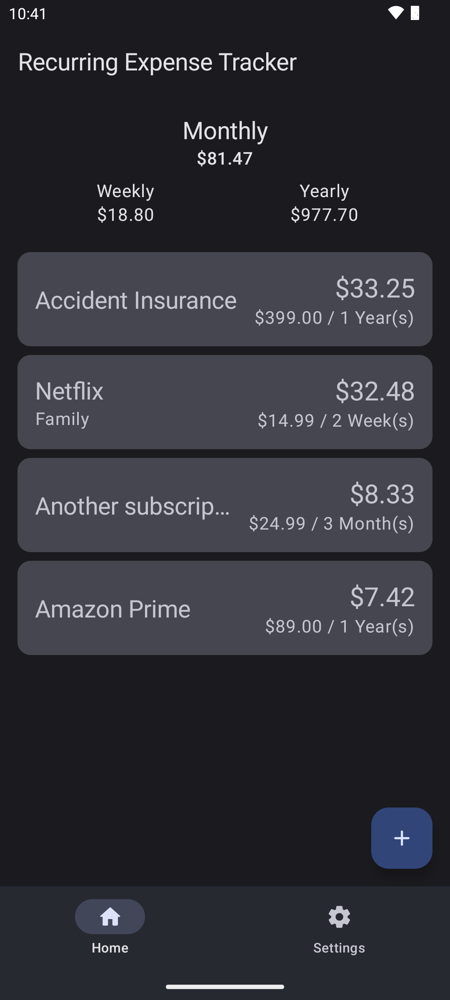
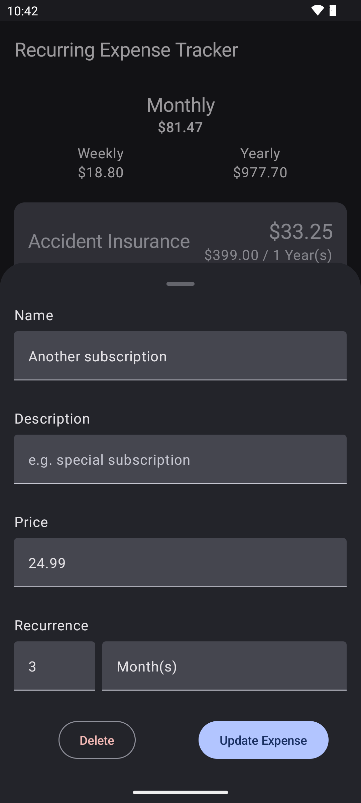

# RecurringExpenseTracker
A Material You recurring expense tracker, allowing you to keep track of your monthly spending.

It's a simple app with the basic functionality of tracking recurring expenses. My idea is to add new features one by one and I'm happy for any contribution. Feel free to create feature requests or report bugs if you find some.

### Screenshots

