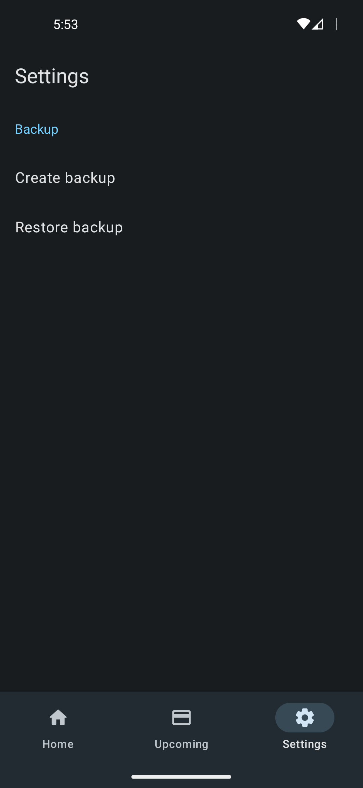
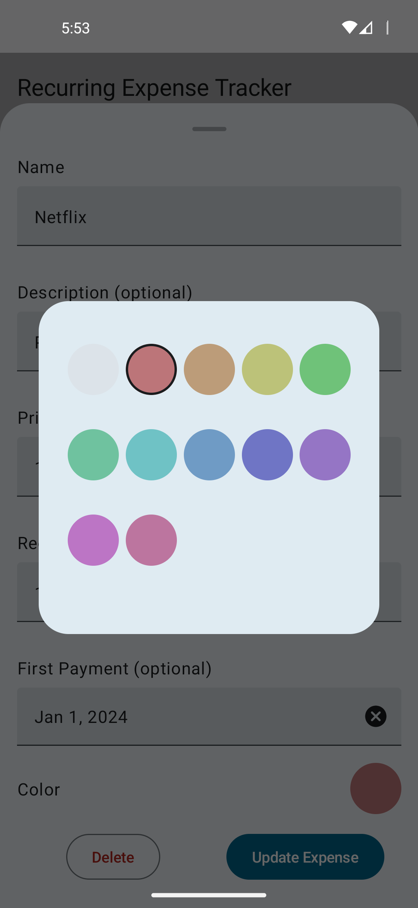

 
<h2 align="center"><b>Recurring Expense Tracker</b></h2>
<h4 align="center">A Material You recurring expense tracker, allowing you to keep track of your monthly spending.
</h4>

## About

As the name suggests, this app focuses on recurring expenses like rent, insurance, subscriptions, and other regular payments.
Built with Kotlin Multiplatform and Material You design principles, it provides a simple yet powerful way to track and visualize your recurring financial commitments.
The app is designed to be intuitive and straightforward, helping you understand exactly where your money goes each month.
My idea is to add new features iteratively, and I'm happy for any contribution. Feel free to make feature requests or report bugs if you find any.

## Features

### 💰 Expense Management
- **Recurring Expenses Tracking**: Track expenses with daily, weekly, monthly, or yearly recurrence patterns
- **First Payment Date**: Define when an expense starts to accurately calculate upcoming payments
- **Expense Details**: Add names, descriptions, and prices to keep everything organized
- **Monthly Cost Calculation**: Automatically converts all expenses to monthly equivalents for easy comparison

### 🏷️ Organization & Customization
- **Tags System**: Organize expenses with customizable tags (evolved from the original color categories)
- **Extended Color Palette**: Choose from an expanded color palette or use the custom color picker
- **List and Grid Views**: Switch between list and grid layouts to view your expenses

### 💱 Multi-Currency Support
- **170+ Currencies**: Support for a wide range of global currencies
- **Currency Per Expense**: Define different currencies for individual expenses
- **Exchange Rate Calculations**: Automatic conversion to your default currency with regularly updated exchange rates

### 📅 Upcoming Payments
- **Payment Overview**: See all upcoming payments in a dedicated tab
- **Payment Timeline**: Track when each expense will be due

### 🔔 Notifications & Reminders
- **Payment Notifications**: Get notified about upcoming expenses
- **Multiple Reminders**: Set multiple reminder times for each expense
- **Customizable Alerts**: Configure when and how you want to be reminded

### 🔐 Privacy & Security
- **Biometric App Lock**: Secure your financial data with fingerprint or face unlock
- **Local Data Storage**: All data stays on your device
- **Backup & Restore**: Create and restore backups of your expense data
- **No Tracking**: No analytics, no ads, no data collection

### 🤖 Android Features
- **Home Screen Widget**: View upcoming payments directly from your home screen
- **Widget Customization**: Choose transparent or opaque widget backgrounds
- **Android 15 Widget Previews**: Enhanced widget preview support

### 🌍 Internationalization
- **30+ Languages**: Extensive translation support through community contributions
- **Community-Driven Translations**: Help translate the app on [Weblate](https://hosted.weblate.org/engage/recurringexpensetracker/)

### 💡 Advanced Use Cases

#### Net Income Tracking
Track your net income and available funds by entering recurring income (salary, allowances, etc.) as **negative expenses**:
- Your total shows **net available funds** after all recurring expenses
- Income and expenses in one unified view
- Clear picture of your monthly financial situation

**Example:** Monthly Salary `-3000` + Rent `1200` + Insurance `150` = `-1650` available

## 🚀 Download
### Android

### iOS
The app compiles for iOS and works fine, but I do not have an Apple developer account to publish it. That's why it can only be used when compiled locally. Let me know if you have an idea how to solve this problem without paying a $99 annual fee to Apple.

### Desktop platforms (Windows, Linux and macOS)
The app compiles and works for all 3 desktop OS platforms. I'll look into how to publish a version for those platforms in the future.

## 📸 Screenshots
<table>
  <tr>
    <td></td>
    <td></td>
    <td></td>
  </tr>
  <tr>
    <td></td>
    <td></td>
    <td></td>
  </tr>
</table>

## 🤝 Contributing
You have ideas on how to improve this app and want to making it even better?
Feel free to contribute by submitting ideas, <a href="https://hosted.weblate.org/engage/recurringexpensetracker/">add missing translations</a> or even checkout the project and implement the changes yourself. You can build the app like any other normal Android project by using Android Studio.

## ☕ Donate
Donations can be made at:
* https://liberapay.com/DennisBauer

Contributions in any form are welcome!

## 🌐 Translations

## ⭐ Star History
<a href="https://star-history.com/#DennisBauer/RecurringExpenseTracker&Date">
 <picture>
   <source media="(prefers-color-scheme: dark)" srcset="https://api.star-history.com/svg?repos=DennisBauer/RecurringExpenseTracker&type=Date&theme=dark" />
   <source media="(prefers-color-scheme: light)" srcset="https://api.star-history.com/svg?repos=DennisBauer/RecurringExpenseTracker&type=Date" />
   
 </picture>
</a>
