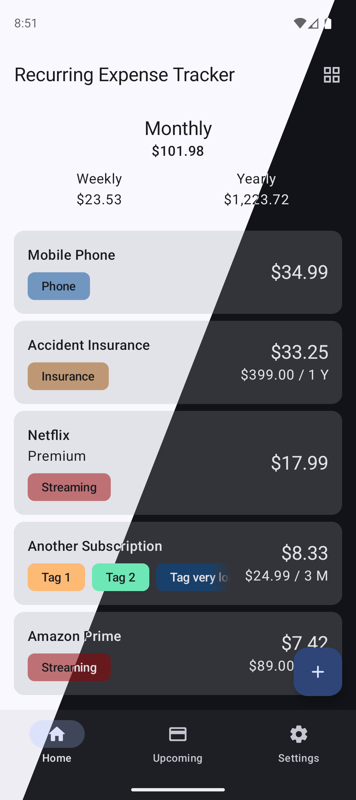

# RecurringExpenseTracker
A Material You recurring expense tracker, allowing you to keep track of your monthly spending.

As the name suggests, it focuses on reoccurring expenses such as rent, insurances, subscriptions etc.
It's a simple app with the basic functionality. My idea is to add new features one by one and I'm happy for any contribution. Feel free to create feature requests or report bugs if you find some.

### Screenshots

