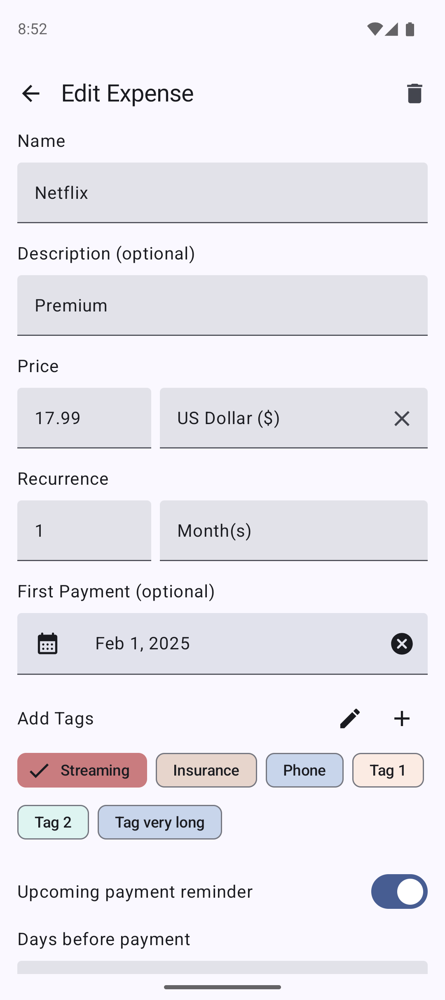
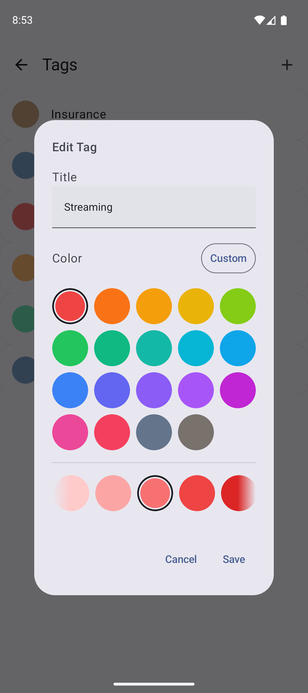
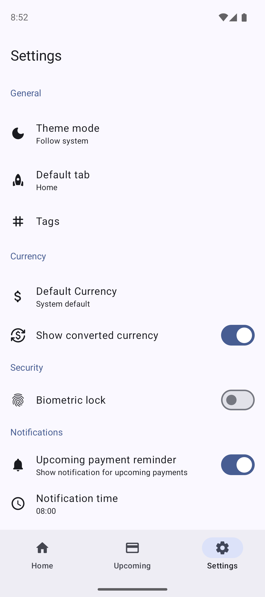
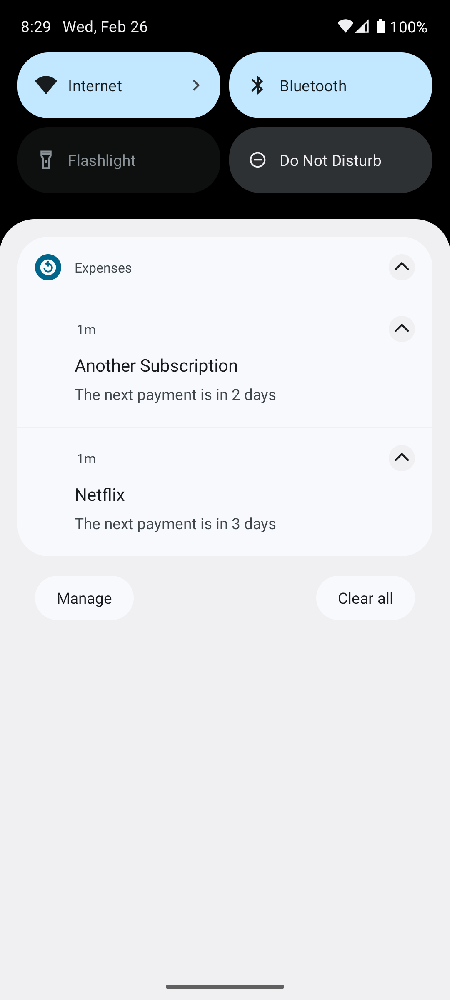

 
<h2 align="center"><b>Recurring Expense Tracker</b></h2>
<h4 align="center">A Material You recurring expense tracker, allowing you to keep track of your monthly spending.
</h4>

As the name suggests, this app focuses on recurring expenses like rent, insurance, subscriptions, etc.
It's a simple Kotlin multiplatform app with basic functionality.
My idea is to add new features iteratively and I'm happy for any contribution.
Feel free to make feature requests or report bugs if you find any.

## Download
### Android

### iOS
The app compiles for iOS and works fine, but I do not have an Apple developer account to publish it. That's why it can only be used when compiled locally. Let me know if you have an idea how to solve this problem without paying a $99 annual fee to Apple.

### Desktop platforms (Windows, Linux and macOS)
The app compiles and works for all 3 desktop OS platforms. I'll look into how to publish a version for those platforms in the future.

## Screenshots
<table>
  <tr>
    <td></td>
    <td></td>
    <td></td>
  </tr>
  <tr>
    <td></td>
    <td></td>
    <td></td>
  </tr>
</table>

## Contributing
You have ideas on how to improve this app and want to making it even better?
Feel free to contribute by submitting ideas, <a href="https://hosted.weblate.org/engage/recurringexpensetracker/">add missing translations</a> or even checkout the project and implement the changes yourself. You can build the app like any other normal Android project by using Android Studio.

## Donate
Donations can be made at:
* https://liberapay.com/DennisBauer

Contributions in any form are welcome!

## Translations

## Star History
<a href="https://star-history.com/#DennisBauer/RecurringExpenseTracker&Date">
 <picture>
   <source media="(prefers-color-scheme: dark)" srcset="https://api.star-history.com/svg?repos=DennisBauer/RecurringExpenseTracker&type=Date&theme=dark" />
   <source media="(prefers-color-scheme: light)" srcset="https://api.star-history.com/svg?repos=DennisBauer/RecurringExpenseTracker&type=Date" />
   
 </picture>
</a>
